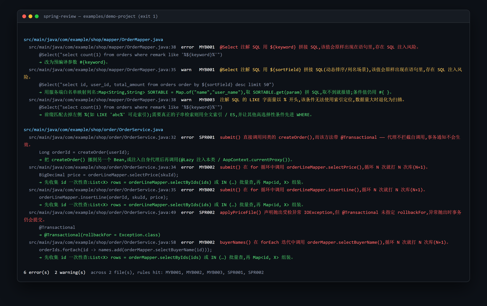

# spring-review

对 Spring / MyBatis 的改动做行级审查。给它一个 git diff，它返回带文件、行号、规则号的问题列表。

它处理的是那些**得懂 Spring 才看得见**的问题：

- 同类里调用的方法带 `@Transactional`。代理拦不到自调用，事务等于没开。编译通过、启动正常、review 也过得去。
- 方法 `throws IOException` 却只写了 `@Transactional`。Spring 默认只回滚 RuntimeException，受检异常抛出后半截写入会被提交。
- `for` 循环里 `orderLineMapper.selectPrice(id)`。一个元素一次查询。
- Mapper XML 里 `where name = '${keyword}'`。`${}` 是字符串拼接。
- `like concat('%', #{kw}, '%')`。前导 `%` 就是索引起作用的地方。
- 单例 Bean 的方法里 `Executors.newFixedThreadPool(8)`。

判定由规则做出。引擎离线运行、不需要 API key、同样的 diff 输出同样的结果。
`--llm` 只改总结那一段文字，测试锁住了"开与不开不会挪动任何一条发现"。



*跑的就是本仓库的 `examples/demo-project`。不需要 API key，不联网。*

> [English README](./README.md) · [规则清单](#规则清单11-条) · [为什么不直接问大模型](#为什么不直接问大模型) · [它做不到什么](#它做不到什么写在明面上)

退出码就是 CI 契约:**0** 无阻塞问题,**1** 存在 error 级发现,**2** 工具自身没跑起来。

### 别看测试样例,看这个

[`examples/demo-project`](./examples/demo-project) 是一个刻意写得平平无奇的 Spring Boot +
MyBatis 小工程——订单、库存、价格规则——坑埋在真实代码会长它的地方,没有
`// 这里触发 SPR001` 这种标签。里面两个文件是照正确写法写的,必须一条不报;
`tests/demo-project.test.ts` 把这件事钉在 CI 上,哪天不成立了就红。

```bash
node dist/cli.js --cwd examples/demo-project --experimental \
  --file $(cd examples/demo-project && find src -name '*.java' -o -name '*.xml')
```

20 条发现,11 条规则全部有代表,干净文件 0 条。那个目录里的表格逐条解释了每个坑
为什么值得一条规则。

## 安装

npm 包还没发，所以现在从源码跑——只要 Node 20+，30 秒搞定：

```bash
git clone https://github.com/JingYu-create520/spring-review.git
cd spring-review
npm ci && npm run build
node dist/cli.js --patch examples/sample.patch     # 先在我们准备的示例 diff 上试一把
```

审自己的项目（在项目根目录里跑）：

```bash
node /路径/spring-review/dist/cli.js --diff HEAD~1..HEAD
node /路径/spring-review/dist/cli.js --file src/main/java/demo/UserService.java
```

等 npm 包发出去后，这里会变成 `npm i -D spring-review` / `npx spring-review`，下面所有命令都不用改。

## 四种用法

**1 · CLI:提交前自查**

```bash
# 包发布之前，把 spring-review 当作 node dist/cli.js 的别名
spring-review                             # 工作区未提交变更
spring-review --diff origin/main..HEAD    # 指定范围
spring-review --staged
spring-review --file src/main/java/demo/UserService.java
spring-review --patch pr.patch --format github
```

只报**新增行**上的问题——存量代码不会被翻出来骚扰你,这是它能进日常流程的前提。

**2 · GitHub Action:PR 自动行级评论**

*（这个形态依赖 npm 包，发包当天即可用；在那之前可以在 workflow 里用 `script:` 步骤
调你 clone 出来的 `dist/cli.js`）*

```yaml
# .github/workflows/spring-review.yml
on: [pull_request]
permissions: { contents: read, checks: write }
jobs:
  review:
    runs-on: ubuntu-latest
    steps:
      - uses: actions/checkout@v4
        with: { fetch-depth: 0 }
      - uses: JingYu-create520/spring-review@v0.1.0
        with:
          exclude: "**/generated/**"
```

发现以 check-run annotations 的形式出现在 Files changed 的行上——不需要仓库 token、
不会刷屏、不用维护评论去重状态。想让 CI 只提示不卡门禁就设 `fail-on-error: false`——
它会把同样的注解降到 `notice` 级别输出，因为 `::error` 是 workflow 命令，本身就会让
job 变红，跟退出码无关。

**2b · GitHub Code Scanning** —— `--format sarif` 输出 SARIF 2.1.0，11 条规则的说明
一起打包进去，于是发现会变成 Security 标签页上**长期存在的告警**，而不是一闪而过的注释：

```yaml
- run: spring-review --diff origin/main..HEAD --format sarif > spring-review.sarif
- uses: github/codeql-action/upload-sarif@v3
  with: { sarif_file: spring-review.sarif, category: spring-review }
```

本仓库每次推 main 就会拿 `tests/fixtures` 这么跑一遍，你可以先在别人的 Security 页上
看到真实效果，再决定要不要装进自己项目。

**3 · MCP server:让编码 Agent 自己审自己**

指到你 clone 的那份（现在就能用）：

```json
{
  "mcpServers": {
    "spring-review": {
      "command": "node",
      "args": ["/路径/spring-review/dist/cli.js", "mcp"]
    }
  }
}
```

等包发到 npm 之后：

```json
{
  "mcpServers": {
    "spring-review": { "command": "npx", "args": ["-y", "spring-review", "mcp"] }
  }
}
```

工具面:`review_diff`(传 patch 文本或 git range)、`review_file`、`list_rules`。
Agent 写完 Spring 代码自己跑一遍,把坑改掉的闭环就此成立——而且判定里没有模型调用,
所以结果可复现。

**4 · Agent Skill**

`skills/spring-review/SKILL.md` 告诉支持 skill 的 Agent 什么时候该跑、怎么读
`findings[]`,拷进你的 skills 目录即可。

## 规则清单(11 条)

`spring-review --list-rules` 可以直接拿到带说明的机器可读版本。

### Spring

| ID | 查什么 | 级别 |
| --- | --- | --- |
| **SPR001** | 事务自调用:`this.m()` 或裸调用不经过代理,通知静默失效 | error |
| **SPR002** | 方法 `throws` 受检异常却没写 `rollbackFor` —— 默认只回滚 RuntimeException,半截写入会被提交 | error |
| **SPR003** | `@Async` / `@Scheduled` 永远不生效的几种写法:非 public、static、同类调用、`@Scheduled` 带参数 | error |
| **SPR004** | 单例 Bean 方法里 `new Thread` / `Executors.newXxx` —— 线程数失控、无拒绝策略、不会优雅关闭 | error |
| **SPR005** | 单例 Bean 的实例字段被非同步方法写(误报风险高,默认关闭,`--experimental` 打开) | warn |
| **SPR006** | `@Cacheable` 被自调用绕过;或多参数却没显式 `key` | warn |

### MyBatis

| ID | 查什么 | 级别 |
| --- | --- | --- |
| **MYB001** | `${}` 拼接,XML 和 `@Select` 注解 SQL 都扫。MyBatis-Plus 的 `${ew.customSqlSegment}`、动态 `ORDER BY` 降为 warn 并给白名单方案,而不是一刀切误报 | error |
| **MYB002** | N+1:`for` / `while` / `forEach` / `stream().map()` 里调 mapper;`resultMap` 的 `<association select>` 嵌套查询 | error |
| **MYB003** | 左通配 LIKE —— 字面量 `'%x%'`、`concat('%', #{x}, '%')`、`<bind value="'%' + …">` 三种形态都覆盖(只匹配字面量等于这条规则不存在) | warn |
| **MYB004** | `SELECT *`(`count(*)` 不会误报) | warn |
| **MYB005** | 没有 WHERE 也没有 LIMIT 的查询;会从 mapper 接口识别 `IPage` / PageHelper 分页并豁免 | error |

## 为什么不直接问大模型

因为模型看 diff 给不出**能点开的行号**,不保证两次答案一致,也无从判断你的
`ORDER BY ${sortField}` 是"该走白名单"而不是"该改成 #{}"。

所以职责是切开的:

- **规则负责结论。** 每条发现都有规则 ID、证据片段、HEAD 里的行号、修复建议。
  可单测、可复现、断网可用。
- **LLM 负责措辞。** `--llm` 接任意 OpenAI 兼容端点(`SR_LLM_BASE_URL` /
  `SR_LLM_API_KEY` / `SR_LLM_MODEL`),只改总结段落。测试锁死了"开关 --llm 不改变
  findings 的一个字节";端点不通时降级为离线模板,不会把 CI 弄红。

## 它做不到什么(写在明面上)

这类工具的口碑死于误报,所以边界先说清楚:

- **没有编译器、没有 classpath。** 结构来自"注释/字符串掩码 + 括号状态机",
  所以跨文件的 Bean 装配、自定义元注解(`@MyService`)、`@Bean` 注册的类都看不见。
- **拿不准就不报。** 结构解析失败、或者 `--patch` 指向的文件本地不存在,
  依赖上下文的规则会保持沉默并在 `skipped` 里说明原因,而不是猜一个像模像样的结论。
  `${}` 这种行内可判定的规则在片段上依然工作。
- **抑制手段是有的但请节制**:`// spring-review:disable SPR001 "原因"` 写在问题行
  或它上一行都生效;`disable-file` 管整文件;仓库级用 `.spring-review.json`。
- **不替代 SonarQube / Checkstyle。** 它不查异味、不查格式,只查那两个不查的
  Spring / MyBatis 语义坑,并且是在 diff 这一步、几秒之内。

## 开发

```bash
npm ci
npm run typecheck && npm test     # 解析器 / 每条规则正负例 / 误报守卫 / CLI /
                                  # MCP(内存 + 真实 stdio 握手)/ 金样例
npm run build                     # dist/cli.js, dist/index.js, dist/mcp/index.js
```

目录:`src/diff`(patch → 行号)、`src/analyze`(Java 与 mapper XML 结构)、
`src/rules`(11 条规则 + 引擎 + 抑制)、`src/report`、`src/llm`、`src/mcp`。

## 许可

MIT,见 [LICENSE](./LICENSE)。

## 同作者的其他项目

- `sql-index-advisor` —— MySQL / MyBatis 的离线索引顾问,慢日志进、DDL 建议出
- `mcp-tool-gateway` —— 给 MCP 工具调用加 RBAC、审计与人机确认
- `agent-regression` —— Agent 回归测试:trace、评分、卡 PR
